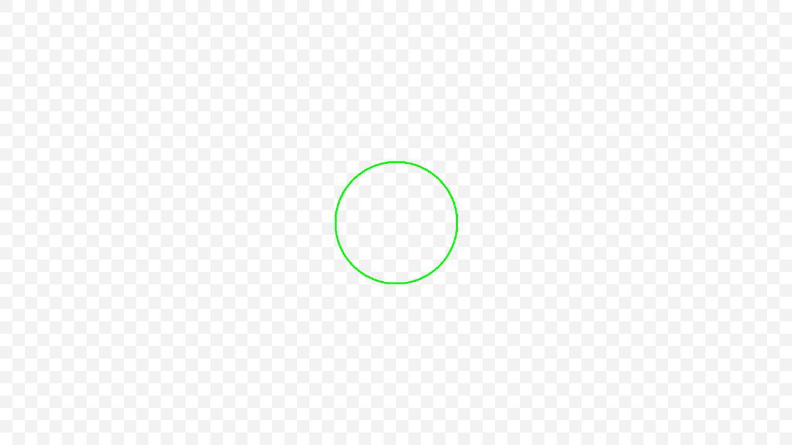

# Shapes Example

Suppose we were making a graphics application where the user can draw shapes on
a canvas. We want to be able to be able to encode the canvas and its shapes so
we can save it to disk, synchronize it with a remote display, or what-have-you.

## [Step 1: Size](./tutorial/step01/README.md)
## [Step 2: Use `size` for Size](./tutorial/step02/README.md)

## [Step 3: Add a Circle](./tutorial/step03/README.md)

## [Step 4: Not Just One Circle](./tutorial/step04/README.md)

## [Step 5: More Shapes](./tutorial/step05/README.md)

## [Step 6: Tell Shapes Apart](./tutorial/step06/README.md)

## [Step 7: Colors!](./tutorial/step07/README.md)

## [Step 8: Meta Shapes](./tutorial/step08/README.md)

## [Step 9: Lots of Houses!](./tutorial/step09/README.md)

## [Step 10: Shapes That Loop Into Themselves](./tutorial/step10/README.md)

