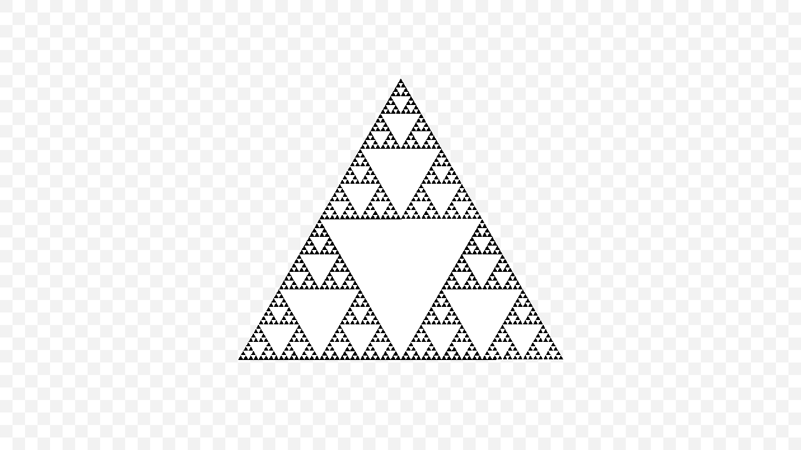
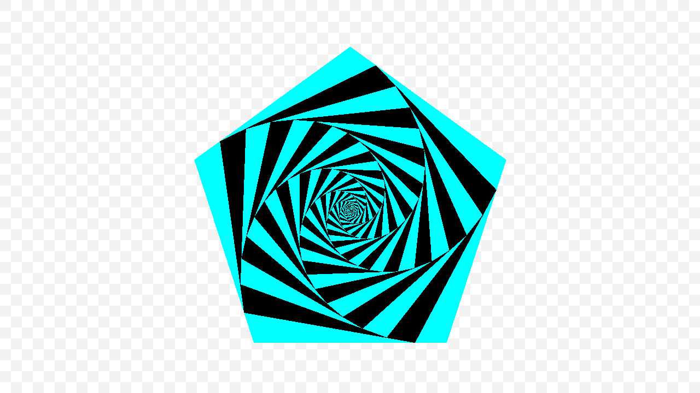

# Fractals

## Sierpinski Triangle



Encoded in 152 bytes:

```ts
```

## Spiral



Encoded in 77 bytes:

```ts
  // Canvas
  128,  10, // Width 1280
  208,   5, // Height 720
    0,      // No background

  // Registry
    1, // One entry in the registry

    7, // String of 7 bytes
  102, 114, 97,  99, 116, 97, 108, // "fractal"

    7, // Option 7: "recursive" shape
   25, // Depth: 25
    4, // Option 4: meta shape (array of shapes)
    3, // 3 elements in the array

    3, // Option 3: "regular-polygon" shape
    5, // sides: 5
    0,   0, // position: { x: 0, y: 0 }
  172,   2, // radius: 300
    0, // rotation: 0
    0, // outline not present
    1, // fill present
    0, 255, 255, 255, // fill: cyan (rgba)

    3, // Option 3: "regular-polygon" shape
    5, // sides: 5
    0,   0, // position: { x: 0, y: 0 }
  142,   2, // radius: 270
   20, // rotation: 10 degrees
    0, // outline not present
    1, // fill present
    0,   0,   0, 255, // fill: black

    6, // Option 6: "transformer" shape
    0, // origin not present (translation)
    1, // rotate present
   40, // rotate: 20 degrees
    1, // scale option 1: ratio
   92, 57, // ratio: 46/57
    5, // Option 5: "reference" shape
    7, // string has 7 bytes
  102, 114,  97,  99, 116,  97, 108, // "fractal"

  // Shape
    6, // Option 6: "transformer" shape
    1, // origin present
  128,  10, 130,   6, // origin: { x: 640, y: 385 }
    0, // rotate not present
    0, // scale not present
    5, // Option 5: "reference shape"
    7, // string has 7 bytes
    102, 114, 97,  99, 116,  97, 108 // "fractal"
```
